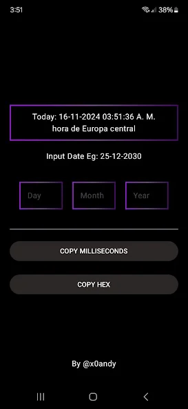
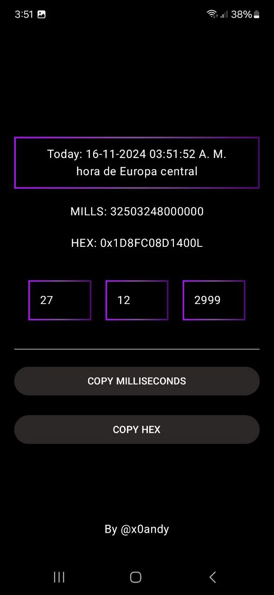

# ToMillis

**ToMillis** is an application that helps you convert time units into milliseconds quickly and efficiently.

[](https://play.google.com/store/apps/details?id=com.tomillis)

---

## Screenshots

 

---

## Features

- Intuitive interface for quick conversions.
- Support for older Android versions using `coreLibraryDesugaring`.
- Implementation of Material Design 3.
- Smooth navigation with Jetpack Compose.

---

## Dependencies

The project uses the following dependencies for modern and efficient development:

### Splash Screen
For a pleasant startup experience:
```gradle
implementation("androidx.core:core-splashscreen:1.0.0")
```

### Dagger Hilt
For dependency injection:
```gradle
implementation("com.google.dagger:hilt-android:2.51.1")
kapt("com.google.dagger:hilt-android-compiler:2.51.1")
```

### Navigation with Hilt
Integration of navigation with Dagger Hilt:
```gradle
implementation("androidx.hilt:hilt-navigation-compose:1.2.0")
```

### Core Library Desugaring
Support for modern APIs in older Android versions:
```gradle
coreLibraryDesugaring("com.android.tools:desugar_jdk_libs:2.0.4")
```

### Jetpack Compose and Material 3
To build the user interface:
```gradle
implementation(libs.androidx.core.ktx)
implementation(libs.androidx.lifecycle.runtime.ktx)
implementation(libs.androidx.activity.compose)
implementation(platform(libs.androidx.compose.bom))
implementation(libs.androidx.ui)
implementation(libs.androidx.ui.graphics)
implementation(libs.androidx.ui.tooling.preview)
implementation(libs.androidx.material3)
```

### Testing
Configuration for unit and UI testing:
```gradle
testImplementation(libs.junit)
androidTestImplementation(libs.androidx.junit)
androidTestImplementation(libs.androidx.espresso.core)
androidTestImplementation(platform(libs.androidx.compose.bom))
androidTestImplementation(libs.androidx.ui.test.junit4)
debugImplementation(libs.androidx.ui.tooling)
debugImplementation(libs.androidx.ui.test.manifest)
```

---

## How to Contribute

If you want to contribute to this project, create a *fork*, make your changes, and open a *pull request*. Your contributions are welcome!

---

## Download the App

Click the button to download the app from Google Play:

[](https://play.google.com/store/apps/details?id=com.tomillis)


## Developer

Andres Vaca

[LinkedIn](https://www.linkedin.com/in/andres-vaca-5794a7178/)
